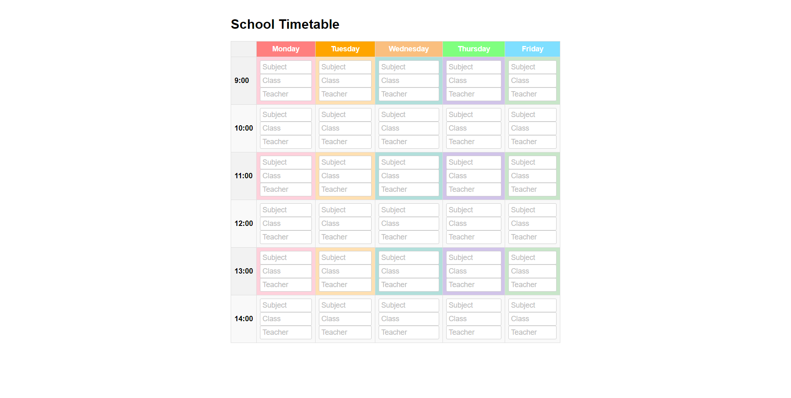

# My Timetable App

This is a simple React app that allows you to create a personal timetable.

## Prerequisites

To run this app, you'll need the following:

- Node.js

## Installation

1. Clone this repository to your local machine using git clone
   gite clone https://github.com/montawork/timetable-app

2. Navigate to the timetable-app directory:
   cd timetable-app

3. Install the dependencies by running npm install

## Running the app

1. Start the development server by running npm start

2. Open http://localhost:3000 in your web browser

## Features

Add subjects to each day of the week

## Usage

Click on a cell in the timetable to add or edit a subject for that time slot and day
If you want to customize the look and feel of the app, you can modify the CSS styles in the Timetable.css file.

## License

This app is licensed under the MIT License. You are free to use, copy, modify, and distribute this software as long as you include the original copyright and license notices.

## Contributing

If you find a bug or have an idea for a new feature, feel free to open an issue or submit a pull request on GitHub. All contributions are welcome!

## Credits

This app was created by [Montassar Haddaji](https://www.linkedin.com/in/montassar-haddaji/).

## Contact

If you have any questions or feedback, feel free to contact me at:
Email: hmonta.work@gmail.com
[LinkedIn](https://www.linkedin.com/in/montassar-haddaji/)

;
